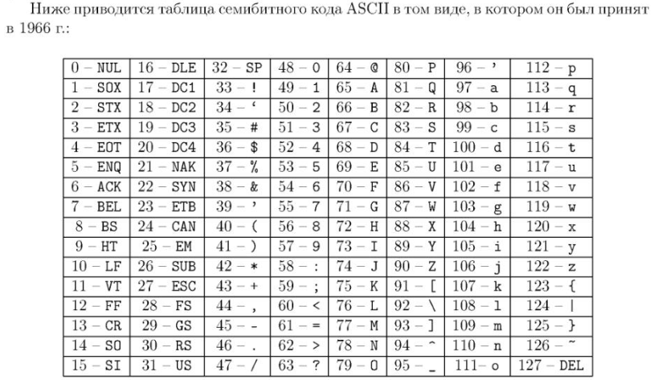

На чём здесь можно сделать акцент:
- Числа 0-9 (места 48-57);
- Буквы (A-Z) (места 65-90);
- Буквы (a-z) (места 97-122).

Все распространённые кодировки содержат ASCII в качестве подмножества.
В ASCII-кодировке нет места для национального алфавита, здесь только латинский.

