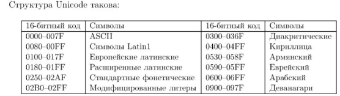

Восьмибитные коды (КОИ-8) удобнее семибитных (ASCII).
Там есть место и для больших, и для малых букв, и для одного национального алфавита. 
Но потребность в локализации (поддержке многоязычия) ПО привела к переходу на 16-битные кодировки, и наиболее известной из них является Unicode.

Unicode разработан Аррle и Хегох (!) в 1988 г.
На сайте unicode.org опубликован стандарт Unicode.

16-битный Юникод позволяет кодировать 65536 знаков вместе 256 8-битных.

Юникод решает проблему национальных алфавитов ценой удвоенного расхода памяти, что по нынешним ценам не так страшно.
Около 29000 кодовых позиций не заняты, а 6000 зарезервированы для использования программистами.

Кроме того, эта кодировка позволяет единообразно представлять строки, допуская смешение алфавитов.

